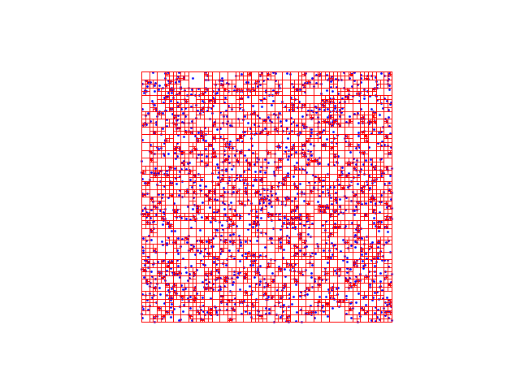
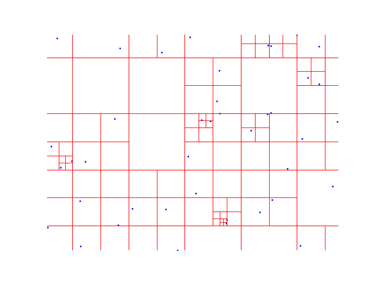

A fully parallel implementation of the Barnes-Hut algorithm for 2D N-body simulation.
Currently performs as follows with N=50000 on a MacBook Air 2025 M4 16GB:
- Tree build: 0.0719s
- Aggregation / center-of-mass calculation: 0.0017s
- Nodal force computation and integration:  0.0076s
Includes the following:
- Statically sized quadtree with arrays for child pointers
- Fast insertion / aggregation method through pointer usage
- Parallelized nodal force calculation and update

Example 2000-particle quadtree.

Next updates
- Post-simulation rendering. Right now, this is the easiest sanity check for the time integration.
- Real-time renderer. this proved to be nontrivial (I don't know OpenGL or other ways for super-fast rendering, so this will be a longer term project).
- Collision / merging when cell size limit is hit.

Long term updates
- Linking this with a fast attention-based ML model + a correction scheme (filtration) could be interesting to probabilistically predict local densities.

